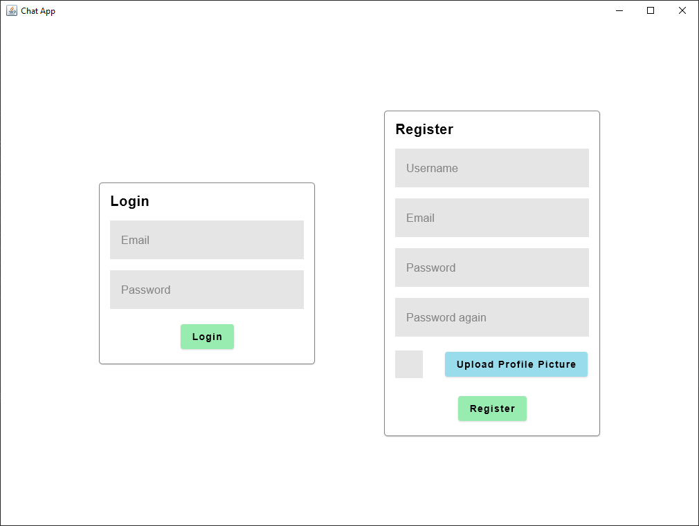
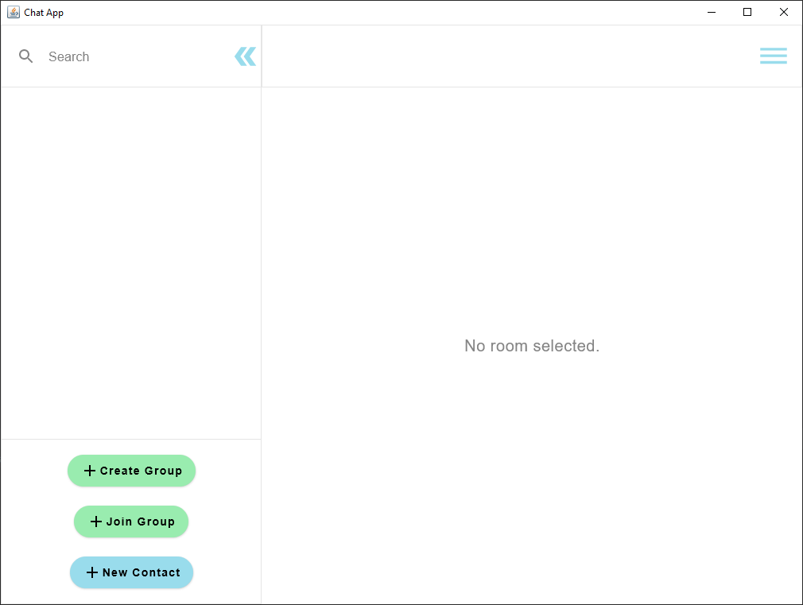
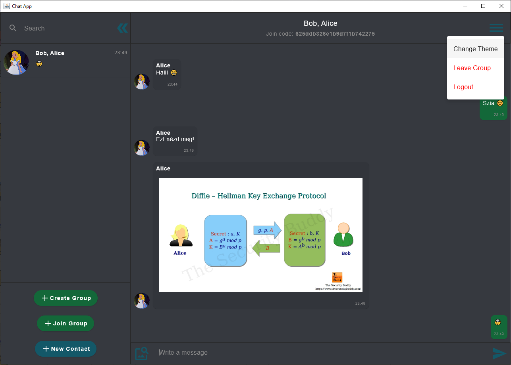
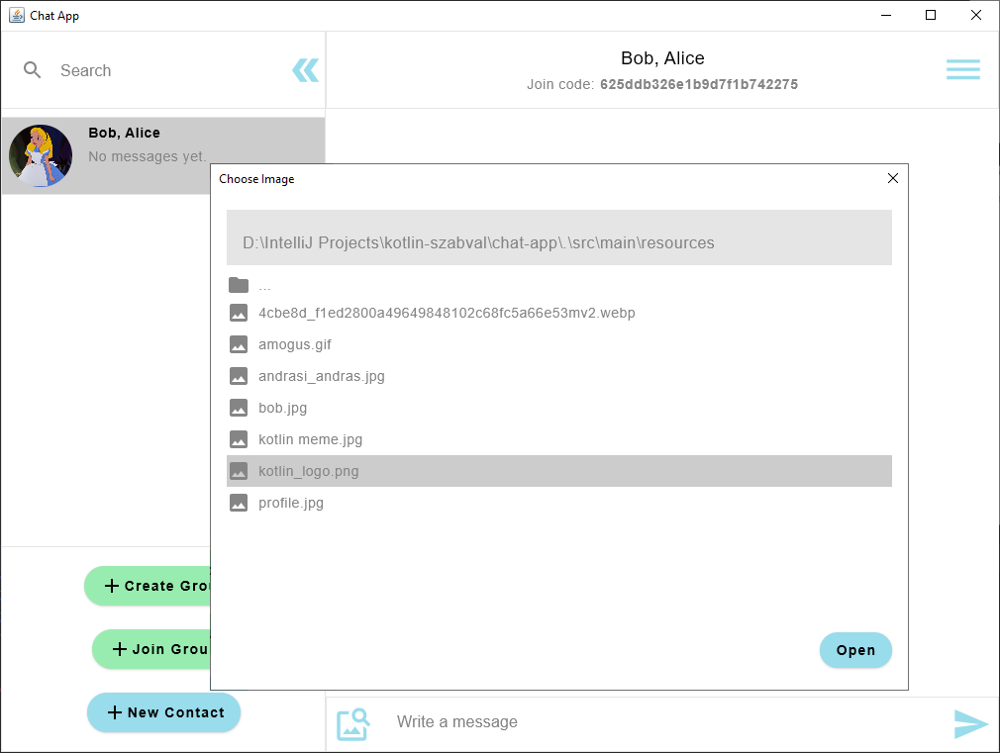

# Chat-App
_Ez az alkalmazás a BME kotlin szabváljához készült házifeladatként, Compose Desktop és ktor-client használatával._

## Funkciók
* Üzenetküldés
* Csoportos beszélgetés
* Képküldés
* Fiók létrehozás

## Futtatás
Ha telepítve van a jdk11^ akkor a projekt gyökeréből az alábbi parancsot futtatva elindul az alkalmazás.
```
./gradlew run
```
Az alkalmazás egy szerverrel kommunikál, mely doménjét `src/main/resources/server.conf`-ban lehet megadni, enélkül nem működik.
A szerver forráskódja megtalálható [itt](https://github.com/jazzysnake/chat-server)







